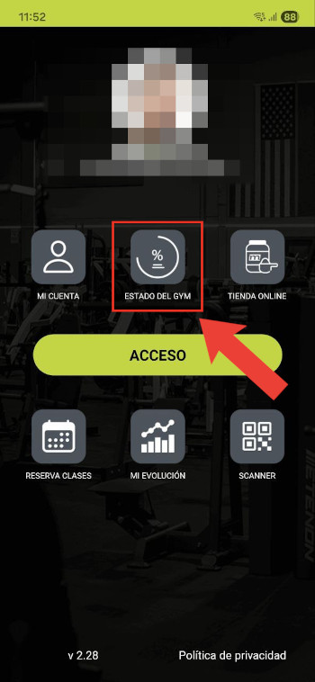

Answering 'how full is the gym?' with reverse engineering and web crawling
---
How to intercept and inspecting an app's traffic using an Android emulator and mitmproxy.

---

A few years ago, I used to go to a gym that had a web status page showing how many people were training at any given time. It looked like this:


```html
 <div class="text-center mt-4">
	<h1 class="display-1">Aforo Actual: 36</h1>
	<div class="aforo" style="color: yellow;">Ocupación Media</div>
	<div class="reloj" style="color: #fff;">
		<em id='reloj'>Reloj?</em>
	</div>
</div>
```

The count was in the HTML itself and the page had no protections whatsoever, so it was easy to crawl. Just for fun, I went ahead and made a crawler to collect the occupancy value every 5 minutes, 24/7, and put them in an SQLite database. This allowed me to make a nicer status page than theirs, with a graph that showed the average attendance over time depending on the day of the week, as well as the live counts for the current day.

I then changed gyms, and the new one used a phone app and had no such status page, so I disabled this little crawler and it slowly faded into oblivion. Until one day, they updated their app, and...

<br>
<div class="image-container">
  
  
</div>


That wasn't there before! I guess it's time to revive and adapt this old project.

# Where is this data coming from?

The first and most obvious problem is to identify exactly *what* to crawl, i.e., the URL of the backend endpoint providing this information. In a web app this is trivial and can be solved by simply inspecting the console. But since this is happening in an Android app, we don't have that luxury and we have to resort to more complicated techniques.

One such technique is to intercept and decipher the traffic flowing between the phone and the server. This is known as a [man-in-the-middle](https://en.wikipedia.org/wiki/Man-in-the-middle_attack) (MITM) attack. The strategy here is to MITM our own phone so we can see exactly what request is made to display the live gym capacity.

## Let's MITM ourselves

After some research, I found [mitmproxy](https://www.mitmproxy.org/), which does exactly what we want. It acts as a "malicious" proxy server that intercepts our requests and displays them in cleartext in a dashboard. It works by impersonating the destination server, presenting a fake certificate, and then forwarding the request to the real server, so it can see all traffic flowing between the two:


Of course, this doesn't work that easily because the client (in this case, our phone) can tell that the certificate presented by mitmproxy is untrustworthy and aborts the connection attempt. To overcome this, we need to install mitmproxy's Certification Authority (CA) certificate, which signs all fake certificates presented by the proxy and completes the trust chain. Mitmproxy helpfully provides its CA certificate in many different formats in its status page:


So, we go ahead and launch mitmproxy, configure our phone to use it as a proxy and install its CA certificate. Filled with hope, we open the gym app, head to the proxy's dashboard, and...


Nothing, just a few unrelated flows and connectivity checks. In fact, the app doesn't even load properly!

The reason why this doesn't work, as I later found out, is that [Android apps ignore user-provided CA certificates](https://android-developers.googleblog.com/2016/07/changes-to-trusted-certificate.html) by default. So our gym app still correctly detects that the server it's trying to connect to is being impersonated and aborts the attempt.

The solution is to either patch the app to disable this protection, or to root my phone so I can add mitmproxy as system-level CA. I had no clue how to do the first, and didn't want to do the second on my own phone because some other apps I have (particularly banking apps) really, *really* don't like rooted phones.

So, we need a rooted Android system that we can just throw away when we're done with this. Let's try again, this time on an Android emulator.

## Let's MITM an Android emulator instead

Mitmproxy helpfully provides [a tutorial](https://docs.mitmproxy.org/stable/howto/install-system-trusted-ca-android/) on how to make it work with an Android emulator, so let's follow it.

### Creating a rooted AVD

The first step is to download, install and run [Android Studio](https://developer.android.com/studio), which is quite straightforward. Then, using its virtual device manager, we need to create an Android Virtual Device (AVD). The form factor doesn't really matter, but we'll need the Play Store so we can install our gym's app, and a suitable version of Android. After some trial and error, I managed to make this whole thing work using Android 13 (Tiramisu), so let's go ahead and pick that one:


A 1.5GB download later, we have our AVD up and running:


Now, we need to root the AVD so we can install mitmproxy's CA as a system CA. The tutorial linked above points us towards [rootAVD](https://gitlab.com/newbit/rootAVD), a script made for this exact purpose.

This, however, ended up being the most challenging part of the process, because rootAVD is a bit outdated (hence having to use an older version of Android) and although it has some documentation, it isn't very successful in showing how you're intended to use the script.

The required sequence of steps to root the AVD is as follows:

0. Preconditions:
	- Make sure `adb` and `emulator` are in your path (they're usually located in `$HOME/Android/Sdk/platform-tools` and `$HOME/Android/Sdk/emulator` respectively)
	- Turn on the AVD
	- Ensure that `adb shell` indeed connects to the AVD.
	- Clone `https://gitlab.com/newbit/rootAVD` somewhere and `cd` to it.

1. Get the path to your AVD's `ramdisk.img` by running `./rootAVD.sh ListAllAVD`
	- This will spit out a long list of possible commands. The relevant bit is the part where it shows the path to the ramdisk (repeated a bunch of times).
	- In my case, it is: `system-images/android-33/google_apis_playstore/x86_64/ramdisk.img`
	- It may show two or more different paths if you have several AVDs. If you use the same Android version I showed in the previous step, it should be the one that contains `android-33`.

2. Install magisk and root the AVD. This isn't a fully automated process, it requires some manual involvement and it's time-gated. Here's what you need to do:
	- Run `./rootAVD.sh /your/path/to/ramdisk.img FAKEBOOTIMG`.
		- In my case: `./rootAVD.sh system-images/android-33/google_apis_playstore/x86_64/ramdisk.img FAKEBOOTIMG`
	- The `FAKEBOOTIMG` param is needed for Android 14+. This bit of required info is given in RootAVD's README but it's quite easy to miss.
	- When rootAVD prompts you for the Magisk version to use, feel free to just hit Enter and use the default one.
	- The Magisk app will be installed in the AVD and opened automatically. You now need to manually install the patch. This must be done within 60 seconds or else rootAVD times out:
		- Tap "**Install**" next to "Magisk".
		- Tap "**Select and patch a file**".
		- Go to the device's downloads folder. You should find a **`fakeboot.img`** file there; select it.
		- You'll be sent back to the previous menu, tap "**Let's go**".
		- Go back to rootAVD and **press enter**. The process should finish successfully and the AVD will shut down.

3. Verify it works
	- Turn the AVD on again and connect to it with `adb shell`. Try running `su`. You should see a Magisk popup asking to confirm, accept it and your shell connection should now have sudo privileges.

The end result should be something like this, with Magisk successfully installed and all tabs in its bottom section available:


### Installing mitmproxy's CA

Let's close **both the AVD and Android Studio**, and run `mitmproxy` (or `mitmweb`, as you prefer) if it wasn't running already.

Get the name of your AVD by running `emulator -list-avds`, mine is called `Medium_Phone`. Start it up so it uses mitmproxy like so: `emulator -avd Medium_Phone -http-proxy 127.0.0.1:8080`.

We should see the same garbage traffic as before on mitmproxy's interface. Open up Chrome in the AVD and navigate to `http://mitm.it/cert/magisk`. It should prompt you to download `mitmproxy-magisk-module.zip`.

Once you have it downloaded, open Magisk, head to the "Modules" tab, and press "Install from storage". Select the module you just downloaded, confirm and reboot.

When it reboots, you should start seeing a lot more traffic pop up in mitmproxy. Just to confirm, head to any HTTPS website, and you should be able to inspect everything.

### And the endpoint is...

The hard part is over, it should be smooth sailing from here. We just need to head to the Play Store, log in and download the gym app. Then click on the live status button and see where the data is coming from:


Victory royale.

# And now, we crawl

If we head to the `/controlpanel/gym-capacity/` endpoint we found, we're greeted with this:


The data is login-gated, a minor inconvenience. Let's inspect the HTML further before coding anything:

```html
<form method="post">
	<input type="hidden" name="_csrf_token" value="d9f477735c7571564fd72.VMT0l-VgS5yZPRZLfWPAu8ue1mgteLOpHPjTdCDPsiE.JoawwIFRDP7ten0gLwmE2KPwmgtbOdDuSo2hA0K81mgWkrynjS4dq-wOUw">
	<div class="mb-3">
		<label>
			<span>Email</span>
			<input type="email" class="form-control" id="username" name="email" value="" required="required" autocomplete="username">
		</label>
	</div>
	<div class="mb-3">
		<label>
			<span>Contraseña</span>
			<input type="password" id="password" name="password" required="required" autocomplete="current-password" class="form-control">
		</label>
	</div>
	<div class="mb-5 d-grid gap-2 max-500">
		<button type="submit" id="_submit" class="btn btn btn-login btn-primary btn-lg btn-block">
			Entrar
		</button>
	</div>
	<div class="mb-0 mt-5 max-500 text-center">
		<a class="btn font-small btn-outline btn-sm ms-1 me-1 mb-3" href="/register">Crear una cuenta</a>
		<a class="btn font-small btn-outline btn-sm ms-1 me-1 mb-3" href="/reset-password">Recordar contraseña</a>
	</div>
	<input type="hidden" id="remember_me" name="_remember_me" value="on"/>
</form>
```

On top of the `email` and `password` fields, there's a `_csrf_token` hidden field whose value changes with every refresh. This is a commonly used security measure to prevent cross-site request forgery (hence the CSRF acronym), and it's normally accompanied by some sort of session token or cookie.

As we saw in the traffic we intercepted, this server uses a `PHPSESSID` cookie to maintain sessions, so in order to log in, we need to send the session cookie and CSRF token provided by the server along with our form data.

Using Python, this is fairly straightforward with Requests and BeautifulSoup:

```py
def login(session: requests.Session, html: bytes) -> bytes:
    soup = BeautifulSoup(html, 'lxml')
    csrf = soup.select_one('input[name="_csrf_token"]')['value']

    url = 'https://app.████████████/login'
    payload = {
        '_csrf_token': csrf,
        'email': "██████████@gmail.com",
        'password': "████████████",
        '_remember_me': 'on',
    }

    resp = session.post(url, data=payload, timeout=10)
    return resp.content
```

The advantage of using `requests.Session` is that it keeps track of cookies for us and handles them appropriately, so we don't need to worry about that.

Once we're logged in, the actual occupancy percent is trivial to crawl. In fact, it's inside a JS variable, so a simple regex suffices:

```js
const GC_DATA = {
	percent: 16,
	inside: 16,
	capacityMax: 100,
	cut1: 33,
	cut2: 66
};
```

In Python:
```py
def get_current_capacity(session: requests.Session) -> bytes:
    url = 'https://app.████████████/controlpanel/gym-capacity/'
    resp = session.get(url, timeout=10)
    return resp.content

sess = requests.Session()
html = get_current_capacity(sess)
occupancy = int(re.search(rb'percent:\s*(\d+)', html).group(1))
```

---

With these two functions, we're ready to build the final version of our crawler:

```py
with open(SESSION_FILE, 'r') as f:
	initial_cookie = f.read()

sess = requests.Session()
sess.cookies.set('PHPSESSID', initial_cookie, domain='app.████████████')

html = get_current_capacity(sess)

if b'Iniciar sesi' in html:
	html = login(sess, html)

occupancy = int(re.search(rb'percent:\s*(\d+)', html).group(1))

conn = init_db_conn()
conn.cursor().execute('INSERT INTO GymData (percent) VALUES (?)', (occupancy,))
conn.commit()

final_cookie = sess.cookies['PHPSESSID']
if final_cookie != initial_cookie:
	with open(SESSION_FILE, 'w') as f:
		f.write(final_cookie)
```

A few things to note here:

- The data is stored in a SQLite table for later querying. The table only has a couple of columns: `tstamp TIMESTAMP DEFAULT NOW` and `percent INT`.
- If we try to access the `/controlpanel/gym-capacity/` endpoint and we're shown the login form, the server remembers what we were trying to access and helpfully redirects us to our intended destination right after logging in. So, the `login()` function also returns the HTML to crawl.
- After logging in, the `PHPSESSID` session cookie remains authorized until the cookie expires. So we persist it to a file and reuse it in future crawls, to skip the login step entirely until we're forced to log in again and discard the previous cookie.

# Some stats

The crawler has been collecting data every 5 minutes for a few weeks now. I reused the old front-end I had for it, which looks like this:


The black line represents the values for the present day, and it updates in real time. The thick colored line is the average for this day of the week, while the other dim lines in the background are the averages for the other days of the week.

Even if the statistical data may be a bit distorted due to the holidays, there are a few interesting conclusions we can draw:

- Tuesdays are by far the busiest days, especially in the afternoon/evening. I suppose Monday laziness hits hard.
- Rush hour happens consistently on weekdays around 20:00.
- The best time to work out, besides very early, is during the 15:00 - 17:00 interval. It's a pretty weird time because it's too late for the morning crowd and too early for the evening crowd.
- A surprising number of people train on weekends, especially on Saturdays, with rates similar to those of weekdays.

And finally, here's the interactive graph with the actual live data:

<style>
:root {
	--chart-grid: #ccc;
	--chart-line: #000;
}

[data-theme="dark"] {
	--chart-grid: #333;
	--chart-line: #eee;
}
</style>

<script src="https://cdn.jsdelivr.net/npm/chart.js@2.9.4/dist/Chart.min.js"></script>
<script src="https://cdnjs.cloudflare.com/ajax/libs/axios/0.21.1/axios.min.js"></script>
<canvas id="chart"></canvas>
<script>
let avgs_data = null;
let today_data = null;
let now = new Date();

function cssVar(name) {
	return getComputedStyle(document.documentElement)
		.getPropertyValue(name)
		.trim();
}

function main() {
	axios.get(`https://borrego.dev/app/gym/avgs?${now.getTime()}`)
		.then(resp => {
			avgs_data = resp.data;
			loadChart();
		});

	axios.get(`https://borrego.dev/app/gym/today?${now.getTime()}`)
		.then(resp => {
			today_data = resp.data;
			loadChart();
		});

	window.setInterval(lookForUpdates, 5 * 60 * 1000);
}

///////////////////////////////////////////////////////////////////////////////

function lookForUpdates() {
	let t = new Date().getTime();
	axios.get(`today?${t}`)
		.then(resp => updateChart(resp.data));
}

function loadChart() {
	if (avgs_data == null || today_data == null) return;

	let today = (now.getDay() + 6) % 7;
	let labels = avgs_data.labels;
	let dsets = [];

	let days = ['Monday', 'Tuesday', 'Wednesday', 'Thursday', 'Friday', 'Saturday', 'Sunday'];
	let normalColors = ['#D94141', '#D97A2B', '#D9C22E', '#4FB34F', '#4F7BD9', '#6A4FD9', '#B44FD9'];
	let dimColors = ['#E5BFBF', '#E5D1BC', '#E5E1BC', '#C6E0C6', '#C6CFE5', '#D0C6E5', '#DFC6E5'];

	dsets.push({
		label: 'Today',
		backgroundColor: cssVar('--chart-line'),
		borderColor: cssVar('--chart-line'),
		data: today_data,
		fill: false,
		order: 0,
		borderWidth: 5,
	});

	for (let i = 0; i < days.length; i++) {
		let dayName = days[i];
		let color = i == today ? normalColors[i] : dimColors[i];
		let width = i == today ? 5 : 1;
		let avgPpl = avgs_data.avgs[i];

		let dset = {
			label: dayName,
			backgroundColor: color,
			borderColor: color,
			data: avgPpl,
			fill: false,
			order: i + 1,
			borderWidth: width,
		};

		dsets.push(dset);
	}

	let config = {
		type: 'line',
		data: {
			labels: labels,
			datasets: dsets,
		},
		options: chartSettings
	};

	let ctx = document.querySelector('#chart').getContext('2d');
	window.chart = new Chart(ctx, config);
}

function updateChart(data) {
	let chart = window.chart;
	let todayDataChart = chart.config.data.datasets[0].data;

	if (data.length > todayDataChart.length) {
		todayDataChart.push(data.pop());
		chart.update();
	}
}

///////////////////////////////////////////////////////////////////////////////

const chartSettings = {
	responsive: true,
	title: { display: false },
	legend: {
		labels: {
			fontColor: cssVar('--text')
		}
	},
	tooltips: {
		mode: 'nearest',
		intersect: false,
	},
	hover: {
		mode: 'nearest',
		intersect: true
	},
	scales: {
		xAxes: [{
			display: true,
			scaleLabel: { display: false },
			ticks: {
				fontColor: cssVar('--text')
			},
			gridLines: {
				color: cssVar('--chart-grid'),
				zeroLineColor: cssVar('--chart-grid')
			}
		}],
		yAxes: [{
			display: true,
			scaleLabel: { display: false },
			ticks: {
				fontColor: cssVar('--text')
			},
			gridLines: {
				color: cssVar('--chart-grid'),
				zeroLineColor: cssVar('--chart-grid')
			}
		}]
	},

	elements: {
		point: { radius: 0 }
	}
};


const observer = new MutationObserver(() => {
	window.chart.options.legend.labels.fontColor = cssVar('--text');

	window.chart.data.datasets.forEach(ds => {
		if (ds.label == 'Today') {
			ds.borderColor = cssVar('--chart-line');
		}
	});

	window.chart.options.scales.xAxes.forEach(axis => {
		axis.ticks.fontColor = cssVar('--text');
		axis.gridLines.color = cssVar('--chart-grid');
		axis.gridLines.zeroLineColor = cssVar('--chart-grid');
	});

	window.chart.options.scales.yAxes.forEach(axis => {
		axis.ticks.fontColor = cssVar('--text');
		axis.gridLines.color = cssVar('--chart-grid');
		axis.gridLines.zeroLineColor = cssVar('--chart-grid');
	});

	chart.update();
});

observer.observe(document.documentElement, {
	attributes: true,
	attributeFilter: ['data-theme']
});

document.addEventListener('DOMContentLoaded', main);
</script>