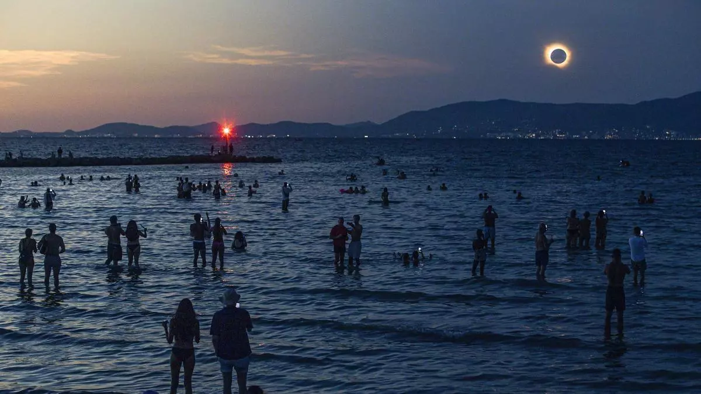

Quick thoughts on watching a solar eclipse
---

Last Wednesday, I was lucky enough to enjoy a clear view of the [total solar eclipse](https://en.wikipedia.org/wiki/Solar_eclipse_of_August_12,_2026) that swept through Spain and other parts of Europe.

The Moon fully covered the Sun for exactly 1:36 minutes. It might as well have been 10 seconds, if you ask me. I thought I knew what it would look like, but I don't think anyone is ever ready for such a sight. It doesn't matter that you can perfectly understand what's happening. The sheer scale and oddity of what you're observing in the sky is enough to make you speechless.

There are many great pictures of it, yet none of them are good enough, nor can they ever be. The camera doesn't capture light, color and the totality of a scene the same way the eye does, but most importantly, an image can't convey the human experience of witnessing one of the most mesmerizing and beautifully ominous sights our solar system has to offer.

What I did not expect at all, however, was to be left with a feeling of pride in our shared species. Humanity has come a long way, and it still has much further to go, with many problems to fix and existential threats to overcome. But we are very lucky to live in a time when we have the knowledge to understand this phenomenon, the science to predict it down to the second hundreds of years in advance, and the technology to watch all of it safely with our own eyes. And it is truly a civilizational feat that, from time to time, we can all sit down in anticipation, put on some silly paper glasses, and enjoy the [music of the spheres](https://en.wikipedia.org/wiki/Musica_universalis) together.

  <figure>
    
    <figcaption><small>Photo by B. Ramón / Diario de Mallorca</small></figcaption>
  </figure>

